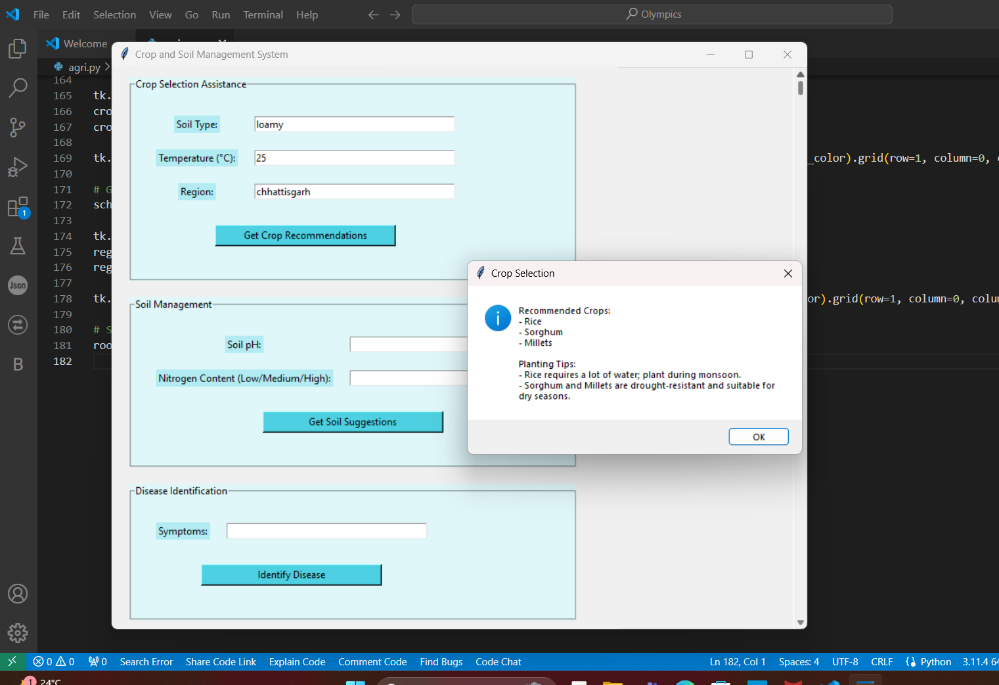

# Soil_Management

## Crop and Soil Management System

### Overview

The **Crop and Soil Management System** is an interactive application built using Python's Tkinter library, designed to support farmers in making informed decisions about their agricultural practices. Created for a hackathon, this application provides a comprehensive suite of tools to enhance farming efficiency and sustainability. The system integrates various functionalities, including crop selection, soil management, disease identification, weather forecasting, and more, tailored to the needs of farmers in different regions, with a focus on regions like Chhattisgarh and Punjab.

### Features

- **Crop Selection Assistance**: 
  - **Input Fields**: Soil type, temperature, and region.
  - **Output**: Provides crop recommendations and planting tips based on the inputs. For example, it suggests crops like Rice and Sorghum for Chhattisgarh and Wheat and Barley for Punjab.
  
  

- **Soil Management**:
  - **Input Fields**: Soil pH and nitrogen content.
  - **Output**: Offers tailored suggestions for soil management actions, such as adding nitrogen-rich fertilizers for soils with low nitrogen content.

- **Disease Identification**:
  - **Input Field**: Symptoms of crop diseases.
  - **Output**: Diagnoses possible diseases based on described symptoms and recommends treatment options. For instance, it identifies Nitrogen Deficiency or Blight based on symptoms like yellow leaves.

- **Weather Forecast**:
  - **Input Field**: Region.
  - **Output**: Provides current weather conditions and forecasts specific to the input region, helping farmers plan their activities effectively.

- **Sustainable Farming Practices**:
  - **Input**: Selection of sustainable practices from a dropdown menu.
  - **Output**: Recommends practices such as drip irrigation, organic pest control, and crop rotation to promote environmental sustainability and resource efficiency.

- **Market Information**:
  - **Input Field**: Crop name.
  - **Output**: Supplies market price information for specified crops, assisting farmers in making informed marketing decisions.

- **Government Schemes**:
  - **Input Field**: Region.
  - **Output**: Lists government schemes and subsidies available in the input region, such as Pradhan Mantri Fasal Bima Yojana for Punjab and Mera Gaon Mera Gaurav for Chhattisgarh.

### Technology Stack

- **Python 3.x**: The programming language used for development.
- **Tkinter**: The graphical user interface (GUI) toolkit for building the application's interface.
- **MessageBox**: For displaying information and recommendations to users.
